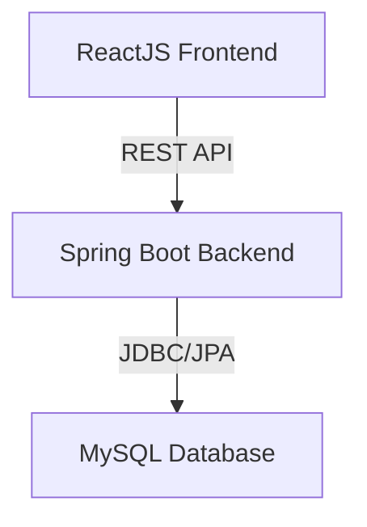

# Kiến Trúc Ứng Dụng: Spring Boot (BE) & ReactJS (FE) với MySQL

## 1. Tổng Quan Kiến Trúc

```
[ReactJS Frontend]  <----REST API---->  [Spring Boot Backend]  <----JDBC/JPA---->  [MySQL Database]
```

- **Frontend:** ReactJS
- **Backend:** Spring Boot
- **Database:** MySQL

## 2. Mô Tả Thành Phần

### ReactJS (Frontend)
- Xây dựng giao diện người dùng động, hiện đại.
- Giao tiếp với backend qua RESTful API.
- Dễ dàng mở rộng, tái sử dụng component.

### Spring Boot (Backend)
- Xử lý logic nghiệp vụ, xác thực, phân quyền.
- Cung cấp API cho frontend.
- Quản lý kết nối và truy vấn dữ liệu với MySQL.

### MySQL (Database)
- Lưu trữ dữ liệu bền vững, hiệu quả.
- Hỗ trợ tốt cho các ứng dụng web quy mô vừa và lớn.

## 3. Lý Do Chọn Spring Boot & ReactJS

### Spring Boot
- **Nhanh chóng phát triển:** Cấu hình tối giản, nhiều starter hỗ trợ sẵn.
- **Bảo mật:** Tích hợp Spring Security dễ dàng.
- **Mở rộng tốt:** Phù hợp cho cả ứng dụng nhỏ và lớn.
- **Cộng đồng mạnh:** Tài liệu, thư viện phong phú.

### ReactJS
- **Hiệu năng cao:** Virtual DOM giúp cập nhật UI nhanh chóng.
- **Component-based:** Dễ bảo trì, tái sử dụng code.
- **Hệ sinh thái lớn:** Nhiều thư viện hỗ trợ UI/UX.
- **SEO-friendly:** Hỗ trợ server-side rendering.

## 4. Sơ Đồ Kiến Trúc



## 5. Kết Luận

Kiến trúc sử dụng Spring Boot cho backend và ReactJS cho frontend kết hợp với MySQL là giải pháp tối ưu cho các ứng dụng web hiện đại, đảm bảo hiệu năng, bảo mật và khả năng mở rộng.